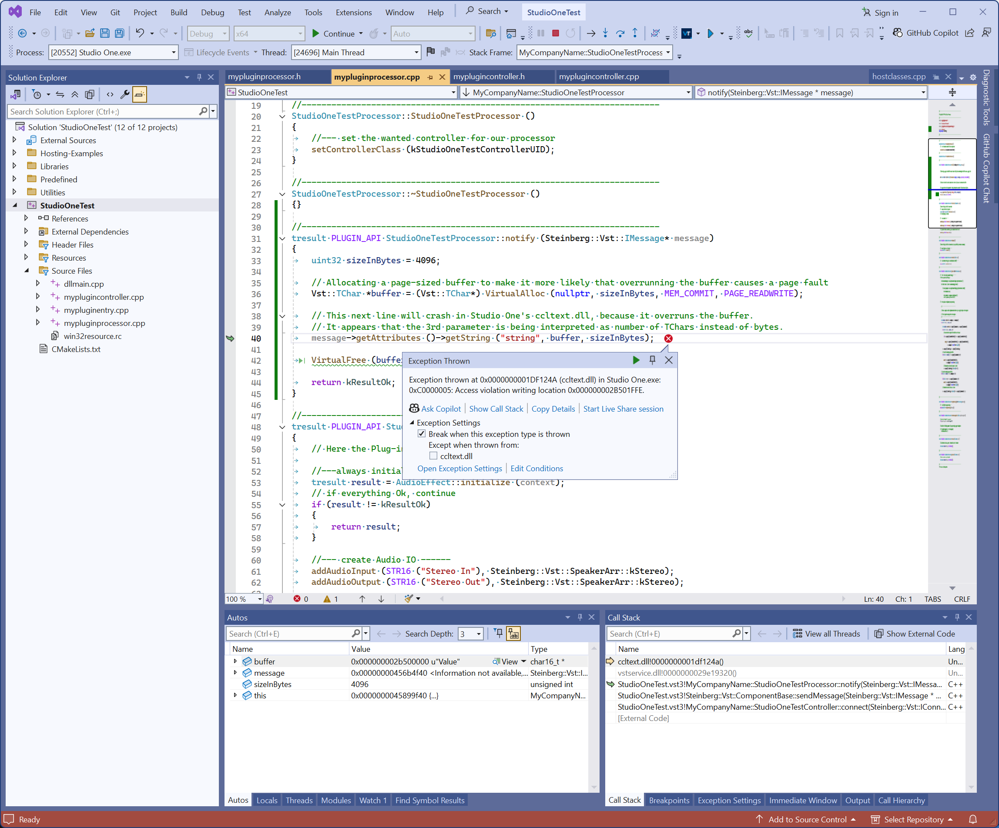

This simple plug-in demonstrates a crash in Studio One's implemetation of [Steinberg::Vst::IAttributeList::getString](https://steinbergmedia.github.io/vst3_doc/vstinterfaces/classSteinberg_1_1Vst_1_1IAttributeList.html#a55f4e61bbda9656f83cddff7ff64f15f)

When instantiated, the EditController sends a message with a string attribute to the AudioProcessor:

```c++
tresult PLUGIN_API StudioOneTestController::connect (IConnectionPoint* other)
{
    EditControllerEx1::connect (other);
    Vst::IMessage *message = allocateMessage ();
    message->setMessageID ("test");
    message->getAttributes ()->setString ("string", STR ("Value"));
    sendMessage (message);
    return kResultOk;
}
```

[source/myplugincontroller.cpp#L16-L24](source/myplugincontroller.cpp#L16-L24)

When the AudioProcessor receives this message and tries to read the string into a buffer, Studio One overruns the buffer:

```c++
tresult PLUGIN_API StudioOneTestProcessor::notify (Steinberg::Vst::IMessage* message)
{
    uint32 sizeInBytes = 4096;

    // Allocating a page-sized buffer to make it more likely that overrunning the buffer causes a page fault
    Vst::TChar *buffer = (Vst::TChar*) VirtualAlloc (nullptr, sizeInBytes, MEM_COMMIT, PAGE_READWRITE);

    // This next line will crash in Studio One's ccltext.dll, because it overruns the buffer.
    // It appears that the 3rd parameter is being interpreted as number of TChars instead of bytes.
    message->getAttributes ()->getString ("string", buffer, sizeInBytes);

    VirtualFree (buffer, 0, MEM_RELEASE);

    return kResultOk;
}
```

[source/mypluginprocessor.cpp#L31-L45](source/mypluginprocessor.cpp#L31-L45)



To build the plug-in, the VST3 SDK and CMake are required.

https://steinbergmedia.github.io/vst3_dev_portal/pages/Getting+Started/Links.html#getting-vst-3-sdk
